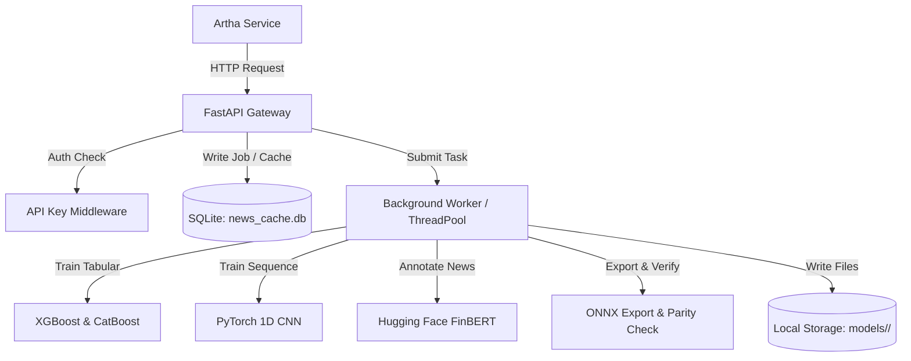

# MacBook Model Lab & ONNX Export Service

A high-performance, standalone FastAPI service for training advanced machine learning models (tabular and sequence), annotating news sentiment with Hugging Face's FinBERT, and validating/exporting models to the ONNX format.

Designed to operate in an isolated environment without broker credentials or live trading API access.

---

## Architecture & Components



---

## Features

- **Asynchronous Training Workers**: Tabular and sequence training jobs run asynchronously using a dedicated thread pool to keep the API server responsive.
- **FinBERT News Caching**: News sentiment annotation includes SQLite-backed caching by `dedupe_hash`. Duplicate news inputs bypass model inference completely.
- **TDD Verification**: Fully tested test suite verifying API authentication, configurations, database logic, mock news cache, tabular/sequence pipeline training, and ONNX parity.
- **ONNX Parity Verification**: Compares Python outputs against ONNX predictions (`onnxruntime`) on a 100-sample verification batch. Validates that max absolute drift is strictly $< 10^{-5}$.
- **macOS Deadlock Prevention**: Environment variables configured at startup limit multi-threading (`OMP_NUM_THREADS = 1`, etc.) to prevent OpenMP deadlocks on Apple Silicon.

---

## Getting Started

### Prerequisites

This service requires Python 3.11+ and `uv` package manager for fast dependency management.

```bash
# Install uv (if not already installed)
curl -LsSf https://astral.sh/uv/install.sh | sh
```

### Installation

Clone the repository and install the dependencies:

```bash
cd noble-turing
uv sync
```

### Running the API Server

Start the FastAPI gateway using `uvicorn`:

```bash
export MACBOOK_API_KEY="your-secret-token"
export DATABASE_PATH="news_cache.db"

uv run uvicorn app.main:app --host 127.0.0.1 --port 8000
```

### Running the Tests

Run the full unit and integration test suite:

```bash
uv run pytest
```

---

## Configuration

The following environment variables configure the service:

| Variable | Default | Description |
|----------|---------|-------------|
| `MACBOOK_API_KEY` | `default-secret-token` | API Key used for headers authorization (`X-API-Key`). |
| `DATABASE_PATH` | `news_cache.db` | Location of the SQLite cache/job tracking database. |
| `MODELS_DIR` | `models` | Directory where trained model artifacts are stored. |
| `DATA_DIR` | `data` | Directory where uploaded dataset CSVs are stored. |

---

## API Documentation

All write/execute endpoints require the `X-API-Key` header matching your `MACBOOK_API_KEY`.

### 1. News Sentiment Annotation
- **Endpoint**: `POST /api/v1/annotate_news`
- **Request Body**:
  ```json
  [
    {
      "event_id": "1",
      "dedupe_hash": "hash_abc123",
      "title": "Stock Surges",
      "snippet": "Market indexes closed at all-time highs today.",
      "matched_symbols": ["SPY"],
      "observed_at": "2026-06-20T12:00:00",
      "source": "news"
    }
  ]
  ```
- **Response**:
  ```json
  [
    {
      "dedupe_hash": "hash_abc123",
      "model_id": "ProsusAI/finbert",
      "sentiment_label": "positive",
      "sentiment_score": 0.95,
      "positive_score": 0.95,
      "negative_score": 0.02,
      "neutral_score": 0.03,
      "annotated_at": "2026-06-20T11:01:03.264345"
    }
  ]
  ```

### 2. Train Tabular Model
- **Endpoint**: `POST /api/v1/train_tabular_model`
- **Form Data**:
  - `config_str`: JSON configuration containing training split details.
  - `file` (optional): Uploaded dataset CSV.
- **config_str JSON format**:
  ```json
  {
    "experiment_id": "manual-exp-1",
    "dataset_id": "ds-1",
    "dataset_uri": "data/dummy_dataset_100.csv",
    "feature_schema_hash": "hash_123",
    "label_definition": "target",
    "train_split": {"type": "indices", "values": [0, 1, 2, 3, 4]},
    "holdout_split": {"type": "indices", "values": [5, 6]},
    "model_family": "xgboost",
    "requested_export_format": "onnx"
  }
  ```
- **Response**:
  ```json
  {
    "model_id": "64a95dba-db6a-4fa6-bb70-f9e265cabe28",
    "status": "pending",
    "message": "Job submitted."
  }
  ```

### 3. Get Model Job Status
- **Endpoint**: `GET /api/v1/model_status/{model_id}`
- **Response**:
  ```json
  {
    "model_id": "64a95dba-db6a-4fa6-bb70-f9e265cabe28",
    "status": "completed",
    "model_family": "xgboost",
    "model_type": "tabular",
    "created_at": "2026-06-20 11:01:40",
    "completed_at": "2026-06-20 11:01:40",
    "error_message": null,
    "metrics": {
      "training_metrics": {"roc_auc": 1.0, "log_loss": 0.094, "f1": 1.0},
      "holdout_metrics": {"roc_auc": 0.312, "log_loss": 1.678, "f1": 0.5},
      "onnx_export_status": "success",
      "onnx_parity_status": "success",
      "blockers": []
    }
  }
  ```

### 4. Fetch/Download Model Artifacts
- **Fetch List**: `GET /api/v1/model_artifact/{model_id}`
- **Download File**: `GET /api/v1/model_artifact/{model_id}/{filename}`

---

## Directory Structure

```text
noble-turing/
  ├── app/
  │    ├── __init__.py
  │    ├── main.py              # FastAPI routers and background jobs
  │    ├── auth.py              # X-API-Key token validation
  │    ├── database.py          # SQLite connections & init
  │    ├── config.py            # Environment configurations (OpenMP settings)
  │    ├── models_lab/          # ML Modules
  │    │    ├── __init__.py
  │    │    ├── tabular.py      # Tabular XGBoost / CatBoost training
  │    │    ├── sequence.py     # PyTorch CNN time-series training
  │    │    └── onnx_utils.py   # ONNX conversions & parity tests
  ├── data/                     # Uploaded dataset storage
  ├── models/                   # Serialized artifacts by model_id
  ├── news_cache.db             # Local SQLite database
  ├── pyproject.toml            # uv configuration
  └── tests/                    # Unit & integration test suites
```
