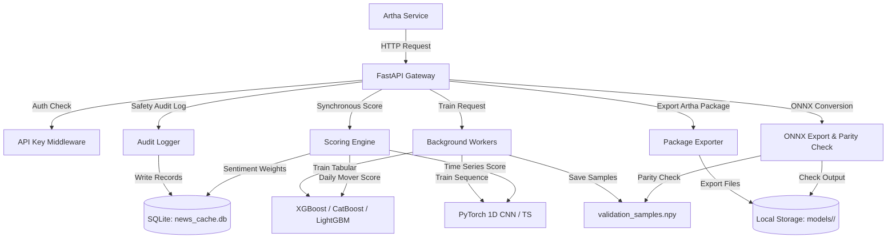

# MacBook Model Lab & Artha Model Service

A high-performance, standalone FastAPI service for training advanced machine learning models (tabular and sequence), scoring daily-mover and time-series candidates, annotating news sentiment with Hugging Face's FinBERT, and exporting/validating model packages.

Designed to operate in an isolated environment as an Artha-compatible external model service without broker credentials or live trading API access.

---

## Architecture & Components



---

## Features

- **Asynchronous Training Workers**: Tabular and sequence training jobs run asynchronously using a dedicated thread pool to keep the API server responsive.
- **FinBERT News Caching**: News sentiment annotation includes SQLite-backed caching by `dedupe_hash` and tracks cache hits. Full event details are stripped for clean, lightweight output.
- **Safety Audit Logging**: Automatically logs all mutating and scoring requests into a SQLite `audit_records` table, with full SHA-256 hashing and API key/secret redaction.
- **Synchronous Candidate Scoring**: Implements direct candidate scoring for `daily_mover` and `time_series` pipelines, executing zero-filling, schema verification, news sentiment weight mapping, and structured blocker propagation.
- **Standard Artha Packaging Exporter**: Generates standard package structures (`onnx` and `mac_api` layouts) with `approval.json` (defaulting to `not_approved`, or `blocked` on parity failures) and complete validation reports.
- **Deterministic ONNX Parity Verification**: Saves real validation data samples to `validation_samples.npy` during training and executes parity checks against actual validation rows under a strict default tolerance of `0.0001` (1e-4).
- **LightGBM Training Blocker**: Tabular training gracefully errors with a blocker response if LightGBM is requested but not installed, preventing silent fallback.
- **macOS Deadlock Prevention**: Environment variables configured at startup limit multi-threading (`OMP_NUM_THREADS = 1`, etc.) to prevent OpenMP deadlocks on Apple Silicon.

---

## Getting Started

### Prerequisites

This service requires Python 3.11+ and `uv` package manager for fast dependency management.

```bash
# Install uv (if not already installed)
curl -LsSf https://astral.sh/uv/install.sh | sh
```

### Installation

Clone the repository and install the dependencies:

```bash
cd noble-turing
uv sync
```

### Running the API Server

Start the FastAPI gateway using `uvicorn`:

```bash
export MACBOOK_API_KEY="your-secret-token"
export DATABASE_PATH="news_cache.db"

uv run uvicorn app.main:app --host 127.0.0.1 --port 8000
```

### Running the Tests

Run the full unit and integration test suite:

```bash
uv run pytest
```

---

## Configuration

The following environment variables configure the service:

| Variable | Default | Description |
|----------|---------|-------------|
| `MACBOOK_API_KEY` | `default-secret-token` | API Key used for headers authorization (`X-API-Key`). |
| `DATABASE_PATH` | `news_cache.db` | Location of the SQLite cache/job tracking database. |
| `MODELS_DIR` | `models` | Directory where trained model artifacts are stored. |
| `DATA_DIR` | `data` | Directory where uploaded dataset CSVs are stored. |
| `DEFAULT_ONNX_PARITY_TOLERANCE` | `0.0001` | Strict maximum absolute drift tolerance for ONNX parity checks. |

---

## API Documentation

All non-health endpoints require the `X-API-Key` header matching your `MACBOOK_API_KEY`. Dual-compatibility endpoints accept either root bare paths (e.g. `/annotate_news`) or api-prefixed paths (e.g. `/api/v1/annotate_news`).

### 1. Health & Status
- **Endpoint**: `GET /health` (Unauthenticated)
- **Response**:
  ```json
  {
    "status": "ok",
    "service": "noble-turing",
    "version": "0.1.0",
    "commit": "1757089497c082415c8e795656e76d34c3689b90",
    "time": "2026-06-20T18:55:16.123456"
  }
  ```

- **Endpoint**: `GET /api/v1/readiness`
- **Response**: Details active jobs, FinBERT status, GPU/MPS device acceleration, and DB configuration.

- **Endpoint**: `GET /api/v1/capabilities`
- **Response**: Returns supported model families, package formats, and active routes.

### 2. Candidate Scoring
- **Daily Mover Endpoint**: `POST /score_daily_mover_candidates` or `POST /api/v1/score_daily_mover_candidates`
- **Request Body (JSON)**:
  ```json
  {
    "model_id": "model_uuid",
    "model_package_id": "pkg_model_uuid",
    "feature_schema_hash": "hash_123",
    "candidates": [
      {
        "candidate_id": "AAPL",
        "features": {"f0": 1.2, "f1": -0.5},
        "news_event_ids": ["news_hash_1"]
      }
    ]
  }
  ```
- **Response**: Returns predicted scores or `status: "blocked"` if the model is missing or features mismatch.

- **Time Series Endpoint**: `POST /score_time_series_candidates` or `POST /api/v1/score_time_series_candidates`

### 3. Model Packaging Exporter
- **Endpoint**: `POST /export_artha_package` or `POST /api/v1/export_artha_package`
- **Form Parameters**:
  - `model_id`: UUID of the model
  - `package_type`: `"onnx"` or `"mac_api"`
- **Response**:
  ```json
  {
    "status": "success",
    "model_id": "model_uuid",
    "package_type": "mac_api",
    "exported_files": ["approval.json", "model_package.json", "feature_schema.json", "validation_report.json", "thresholds.json", "mac_api.json"]
  }
  ```

### 4. News Sentiment Annotation
- **Endpoint**: `POST /annotate_news` or `POST /api/v1/annotate_news`
- **Request Body**: List of news items to score using FinBERT.

### 5. Model Training (Asynchronous)
- **Tabular**: `POST /train_tabular_model` or `POST /api/v1/train_tabular_model`
- **Time Series**: `POST /train_time_series_model` or `POST /api/v1/train_time_series_model`

---

## Directory Structure

```text
noble-turing/
  ├── app/
  │    ├── __init__.py
  │    ├── main.py              # FastAPI routers and background jobs
  │    ├── auth.py              # X-API-Key token validation
  │    ├── database.py          # SQLite connections & init
  │    ├── config.py            # Environment configurations (OpenMP settings)
  │    ├── audit.py             # Redaction-aware safety audit logging
  │    ├── health.py            # Health status, readiness, capabilities engine
  │    ├── scoring/             # Scoring engine for movers and time series
  │    │    ├── __init__.py
  │    │    ├── daily_mover.py  # Tabular and news sentiment inference
  │    │    └── time_series.py  # Sequential tensor shape inference
  │    ├── packaging/           # Standard packaging engine
  │    │    ├── __init__.py
  │    │    └── artha_package.py# Package structure layout exporter
  │    ├── models_lab/          # ML Modules
  │    │    ├── __init__.py
  │    │    ├── tabular.py      # Tabular training & validation saving
  │    │    ├── sequence.py     # PyTorch training & validation saving
  │    │    └── onnx_utils.py   # ONNX conversions & real-sample parity check
  │    
  ├── data/                     # Uploaded dataset storage
  ├── models/                   # Serialized artifacts by model_id
  ├── news_cache.db             # Local SQLite database
  ├── pyproject.toml            # uv configuration
  └── tests/                    # Unit & integration test suites
```

---

## Deployment & Configuration

For full details on environment variables, startup commands, local network (LAN) exposure, and endpoint verification steps, please refer to the [DEPLOYMENT.md](file:///Users/shivamsharma/Documents/antigravity/noble-turing/DEPLOYMENT.md) guide.
