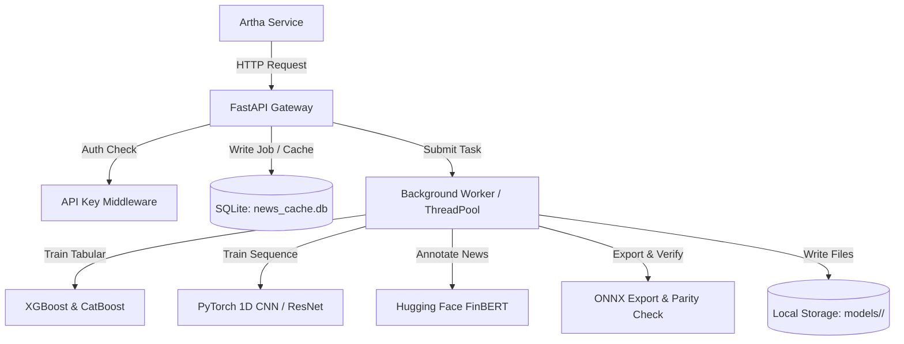

# Design Spec: MacBook Model Lab & ONNX Export Service

This document defines the architecture and design of the MacBook Model Lab service, which operates as an isolated model training and inference provider. It trains advanced models, annotates news with FinBERT, exports models to ONNX, runs parity validation, and returns metrics and artifact metadata.

## Overview
The MacBook Model Lab is designed to run on high-performance hardware (e.g., Apple Silicon MacBook with 48GB unified memory) without broker credentials or live trading API access. It communicates exclusively via authenticated HTTP APIs.

---

## 1. System Architecture & Components



---

## 2. API Schema Definitions

All requests must contain the `X-API-Key` header matching the `MACBOOK_API_KEY` environment variable.

### News Annotation (`POST /api/v1/annotate_news`)
- **Request Body**:
  ```json
  [
    {
      "event_id": "string",
      "dedupe_hash": "string",
      "title": "string",
      "snippet": "string",
      "matched_symbols": ["string"],
      "observed_at": "string",
      "source": "string"
    }
  ]
  ```
- **Response Body**:
  ```json
  [
    {
      "dedupe_hash": "string",
      "model_id": "string",
      "sentiment_label": "positive | negative | neutral",
      "sentiment_score": 0.95,
      "positive_score": 0.95,
      "negative_score": 0.02,
      "neutral_score": 0.03,
      "annotated_at": "string"
    }
  ]
  ```

### Tabular Model Training (`POST /api/v1/train_tabular_model`)
- **Request Body**:
  ```json
  {
    "experiment_id": "string",
    "dataset_id": "string",
    "dataset_uri": "string",
    "feature_schema_hash": "string",
    "label_definition": "string",
    "train_split": {
      "type": "indices | timestamp | column",
      "values": []
    },
    "holdout_split": {
      "type": "indices | timestamp | column",
      "values": []
    },
    "model_family": "xgboost | catboost | autogluon | tabm | tabpfn",
    "requested_export_format": "onnx"
  }
  ```
- **Response Body**:
  ```json
  {
    "model_id": "string",
    "status": "pending",
    "message": "Model training job successfully submitted."
  }
  ```

### Time-Series Model Training (`POST /api/v1/train_time_series_model`)
- **Request Body**:
  ```json
  {
    "experiment_id": "string",
    "dataset_id": "string",
    "dataset_uri": "string",
    "sequence_schema_hash": "string",
    "label_definition": "string",
    "train_split": {
      "type": "indices | timestamp | column",
      "values": []
    },
    "holdout_split": {
      "type": "indices | timestamp | column",
      "values": []
    },
    "model_family": "pytorch_cnn | minirocket | inceptiontime | tcn",
    "requested_export_format": "onnx"
  }
  ```
- **Response Body**:
  ```json
  {
    "model_id": "string",
    "status": "pending",
    "message": "Time-series training job successfully submitted."
  }
  ```

### Job Status Query (`GET /api/v1/model_status/<model_id>`)
- **Response Body**:
  ```json
  {
    "model_id": "string",
    "status": "pending | training | completed | failed",
    "model_family": "string",
    "model_type": "tabular | sequence",
    "created_at": "string",
    "completed_at": "string",
    "error_message": "string | null",
    "metrics": {
      "training_metrics": {},
      "holdout_metrics": {},
      "onnx_export_status": "success | failed | unsupported",
      "onnx_parity_status": "success | failed | unchecked",
      "blockers": []
    }
  }
  ```

---

## 3. FinBERT Caching & Deduplication
- We use a SQLite database (`news_cache.db`) with the table `news_annotations`.
- During `POST /annotate_news`, we split the batch:
  - Cache hits: Fetched directly from SQLite.
  - Cache misses: Sentiment scored using FinBERT (`ProsusAI/finbert`) on MPS/CPU, then inserted into SQLite.
- Preserves the request order in the API response.

---

## 4. ONNX Export & Parity Validation
- Tabular models are serialized and run through ONNX converters (`onnxmltools` / `skl2onnx` / CatBoost's native exporter).
- PyTorch sequence models use `torch.onnx.export`.
- Parity is validated by running a test batch (e.g. 100 validation rows) through both:
  1. Python model (`predict_proba` or PyTorch forward pass)
  2. ONNX model via `onnxruntime`
- Threshold check: Max absolute difference $\max |P_{\text{python}} - P_{\text{onnx}}| < 10^{-5}$.
- Results are saved to `<model_id>/onnx_parity_report.json`.

---

## 5. Directory Structure & State Management

```text
noble-turing/
  ├── app/
  │    ├── __init__.py
  │    ├── main.py              # FastAPI entrypoint & router registrations
  │    ├── auth.py              # X-API-Key token dependency injection
  │    ├── database.py          # SQLite connections & table creation logic
  │    ├── config.py            # Service config (API keys, directories, HuggingFace settings)
  │    ├── models_lab/          # ML Training, Scoring, & ONNX export logic
  │    │    ├── __init__.py
  │    │    ├── tabular.py      # XGBoost / CatBoost training logic
  │    │    ├── sequence.py     # PyTorch CNN training logic
  │    │    ├── onnx_utils.py   # ONNX export and parity checks
  │    │    └── finbert.py      # FinBERT pipeline wrapper
  ├── data/                     # Uploaded dataset storage
  ├── models/                   # Model artifact directories
  │    └── <model_id>/
  │         ├── metadata.json
  │         ├── training_report.json
  │         ├── holdout_report.json
  │         ├── feature_importance.json
  │         ├── calibration.json
  │         ├── model.pkl or model.pt
  │         ├── model.onnx
  │         └── onnx_parity_report.json
  ├── news_cache.db             # SQLite storage (caching & job metadata)
  └── pyproject.toml            # Package configuration managed by uv
```

## 6. Self-Review Checklist
- **No placeholders**: All endpoints, DB schemas, and paths are fully specified.
- **Consistent schemas**: Output formats and files align with Artha's contract requirements.
- **Clear boundaries**: The service is self-contained with no external dependencies (like Redis/Celery) or live broker connections.
